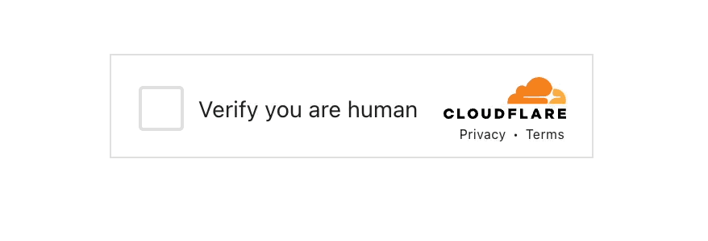

<div align="center">
    <h1>OnCourse.Turnstile</h1>
    
    <p>ASP.NET Core middleware for integrating <a href="https://developers.cloudflare.com/turnstile">Cloudflare Turnstile CAPTCHA</a>.</p>

[](https://www.nuget.org/packages/OnCourse.Turnstile/)
[](https://github.com/oncoursesystems/OnCourse.Turnstile/blob/main/LICENSE)

</div>

## Requirements

This package requires a secret key and a site key provided by [Cloudflare Turnstile](https://developers.cloudflare.com/turnstile/). You can obtain these keys by signing up for a free account on their website.

## Installing the NuGet Package

You can install the package from [NuGet](https://www.nuget.org/packages/OnCourse.Turnstile/) or with one of the following commands:

```bash
# Using the NuGet Package Manager Console
PM> Install-Package OnCourse.Turnstile

# Using the .NET CLI
dotnet add package OnCourse.Turnstile
```

## Usage

Register the Turnstile service in your `Program.cs`:

```csharp
// Pass in configuration options from appsettings.json
builder.Services.AddTurnstile(builder.Configuration.GetSection("Turnstile"));

// Or configure directly in code
builder.Services.AddTurnstile(options =>
{
    options.SiteKey = "your-site-key";
    options.SecretKey = "your-secret-key";
});
```

You can then add the Turnstile element to your DOM using the following Razor syntax:

```html
@Html.Turnstile()
```

In the action you are submitting to, you can validate the Turnstile response like this:

```csharp
[ValidateTurnstile]
[HttpPost]
public IActionResult SubmitForm(MyModel model)
{
    if (!ModelState.IsValid)
    {
        return View(model);
    }

    // Process the form submission
    // ...

    return RedirectToAction("Success");
}
```

## Turnstile TagHelper

To use the tag helper, add the following to your `_ViewImports.cshtml`:

```csharp
@addTagHelper *, OnCourse.Turnstile
```

Then, you can use the Turnstile tag helper in your views:

```html
<form method="post">
    <turnstile></turnstile>
    <button type="submit">Submit</button>
</form>
```

### TagHelper Attributes

You can customize the Turnstile tag helper with the following attributes ([Cloudflare documentation](https://developers.cloudflare.com/turnstile/get-started/client-side-rendering/#configurations)):

- `site-key`: The site key for your Turnstile account.
- `action`: A custom value that can be used to differentiate widgets under the same site key in analytics.
- `cdata`: A custom payload that can be used to attach customer data and returned upon validation.
- `callback`: A JavaScript function that will be called when the Turnstile challenge is completed successfully.
- `error-callback`: A JavaScript function that will be called when there is an error with the Turnstile challenge.
- `execution`: Controls when to obtain the token of the widget. Options are `render` (default) or on `execute`.
- `expired-callback`: A JavaScript function that will be called when the Turnstile challenge expires.
- `before-interactive-callback`: A JavaScript function that will be called before the challenge enters interactive mode.
- `after-interactive-callback`: A JavaScript function that will be called when the challenge has left interactive mode.
- `unsupported-callback`: A JavaScript function that will be called when the Turnstile widget is not supported in the current browser/client.
- `theme`: The theme of the Turnstile widget. Options are `light`, `dark`, and `auto` (default).
- `language`: Language to display, must be either `auto` (default) or a valid [language code](https://developers.cloudflare.com/turnstile/reference/supported-languages/).
- `timeout-callback`: A JavaScript function that will be called when the Turnstile challenge was not solved within a given time.
- `size`: The size of the Turnstile widget. Options are `normal` (default), `compact`, and `flexible`.
- `retry`: Controls whether the Turnstile widget should retry automatically if it fails to obtain a token. Options are `auto` (default) or `never`.
- `retry-interval`: The interval in milliseconds to wait before retrying to obtain a token if `retry` is set to `auto`. Default is `8000` ms, maximum value is `900000` ms (15 minutes).
- `refresh-expired`: Automatically refreshes the token when it expires. Options are `auto` (default), `manual` or `never`.
- `refresh-timeout`: Controls whether the widget should automatically refresh after a timeout. Options are `auto` (default), `manual` or `never`.
- `appearance`: Appearance controls when the widget is visible. Options are `always` (default), `execute`, or `interaction-only`.
- `feedback-enabled`: Allows Cloudflare to collect feedback on the widget's performance. Options are `true` (default) or `false`.

## Examples

You can find two example projects in the `Samples` folder of this repository. You will need to set up your own Cloudflare Turnstile keys in the `appsettings.json` files of these projects:

- [`OnCourse.Turnstile.Mvc`](tree/main/Samples/OnCourse.Turnstile.Mvc/): A simple ASP.NET Core MVC application demonstrating basic usage.
- [`OnCourse.Turnstile.RazorPages`](tree/main/Samples/OnCourse.Turnstile.RazorPages/): A simple ASP.NET Core Razor Pages application demonstrating basic usage.

### Dummy Sitekeys and Secretkeys

The following sitekeys and secret keys are available for testing ([docs](https://developers.cloudflare.com/turnstile/troubleshooting/testing/)).  These dummy sitekeys will produce the `XXXX.DUMMY.TOKEN.XXXX` response token. The dummy secret keys will only accept that response token and production secret keys will not accept it.

| Sitekey | Description | 	| Visibility
|---------|-------------|-----------
| 1x00000000000000000000AA | Always passes | visible
| 2x00000000000000000000AB | Always blocks | visible
| 1x00000000000000000000BB | Always passes | invisible
| 2x00000000000000000000BB | Always blocks | invisible
| 3x00000000000000000000FF | Forces an interactive challenge | visible

| Secret key | Description
| 1x0000000000000000000000000000000AA | Always passes
| 2x0000000000000000000000000000000AA | Always fails
| 3x0000000000000000000000000000000AA | Yields a "token already spent" error

